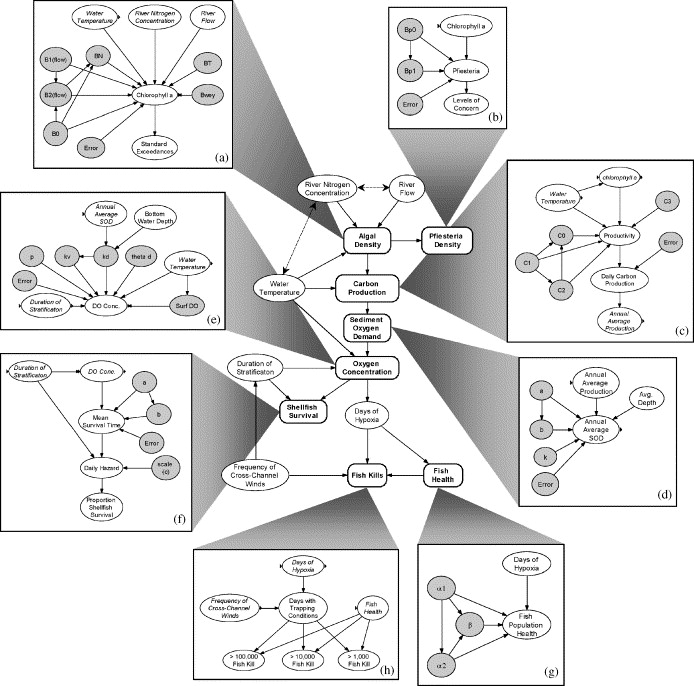

class: title-slide, inverse, left

background-image: url(figs/theB.png)
background-position: right 25px bottom 25px
background-size: 200px

```{css, echo = FALSE}
.title-slide .remark-slide-number {
  display: none;
}

.large { 
  font-size: 130%;
  }
.small { 
  font-size: 70%;
  }
.tiny { 
  font-size: 40%;
  }

```

```{r setup, include=FALSE}
library(magrittr)
library(RefManageR)
options(htmltools.dir.version = FALSE)

cp <- function(bib, keys, ...){
  keys <- gsub("^@", "", keys)
  RefManageR::Citep(bib, keys, ...)
}
ct <- function(bib, keys, ...){
  keys <- gsub("^@", "", keys)
  RefManageR::Citet(bib, keys, ...)
}

RefManageR::BibOptions(check.entries = FALSE, bib.style = "authoryear", max.names=2, 
                       longnamesfirst=FALSE, style = "markdown", dashed = TRUE)
bibf <- 'BHMnBN.bib' %>% 
  #rbbt::bbt_write_bib(overwrite = TRUE) %>% 
  RefManageR::ReadBib()
```

```{r xaringan-extra-all-the-things, echo=FALSE}
xaringanExtra::use_xaringan_extra(
  c("tile_view", "panelset", "tachyons")
)

#xaringanExtra::use_share_again()
#xaringanExtra::style_share_again( share_buttons = "all")

xaringanExtra::use_tachyons()

xaringanExtra::use_extra_styles(
  hover_code_line = TRUE,         #<<
  mute_unhighlighted_code = TRUE  #<<
)

xaringanExtra::use_logo("figs/lu-logo.png",
                        link_url = "https://www.cec.lu.se/")
```

```{r xaringan-themer, include=FALSE, warning=FALSE}
library(xaringanthemer)
style_mono_accent(base_color = "#272822",
  header_font_google = google_font("Josefin Sans"),
  text_font_google   = google_font("Montserrat", "300", "300i"),
  code_font_google   = google_font("Fira Mono")
)
```
<br><br><br>
.f-subheadline.lh-copy.fw6[Both begin with a B]

.f3.fw6.lh-copy[Bayesian networks or Bayesian hierarchical modelling<br> for ecological risk assessment]

<br>

.f3[SETAC North America 2020]

<br>

.f4.fw6[Ullrika Sahlin and Dmytro Perepolkin]   
.f4[Lund University, Sweden]

.f4[2020-11-19]
---

class: inverse, middle, center
background-image: url(figs/ingemar.png)
background-position: left 200px center
background-size: 240px

.pull-right[

.f2["Uncertainty is an uncomfortable position. But certainty is an absurd one."]

Voltaire 1694 - 1778
]
---
# Uncertainty in risk assessment

- Uncertainty arise from limitations in knowledge

- Uncertainty is personal. *Someone* is uncertain
--
.pull-left[
.f5.fw6[Epistemic uncertainty]  


]

--
.pull-right[
.f5.fw6[Aleatory uncertainty]  


]
---
# Uncertainty in risk assessment

- Uncertainty arise from limitations in knowledge

- Uncertainty is personal. *Someone* is uncertain

- Epistemic uncertainty (from Ancient Greek: *ἐπιστήμη*, epistēmē, 'knowledge')

  - uncertainty about the model (including parameters), lack of scientific consensus, small sample sizes, bias or low quality in experimental studies, observation or measurement errors, ambiguous terms, misunderstandings

- Aleatory uncertainty (from Latin *ālĕa*, dice): 
  - inherent randomness in real world systems, heterogeneity, variability, between study variability, chance outcomes

- Ontological uncertainty
  - uncertainty about the future, in which our current objectives, management alternatives and understanding of the world (models) are made obsolete by change.

---
class: inverse, middle, center
background-image: url(figs/Casino-lede-01-1-1300x863.jpg)
background-position: right 100px center
background-size: 400px


.pull-left[
# Tuxedo fallacy
.f3.white["Treating all decisions as if they took place under epistemic conditions analogous to gambling at the roulette table."]

`r ct(bibf, "@hansson2009CasinoJungle", .opts=list(hyperlink=FALSE))`

]

---
# Communicate uncertainty
- Communicating uncertainty to decision makers is important

.bg-light-gray.b--slate-gray.ba.bw1.br3.shadow-5.ph4.mt4[
"Unless uncertainty is known a decision maker can place too much confidence in experts and face unexpected problems or a decision maker can place too little confidence in experts and miss opportunities and resources to collect information has been waisted.  
In some situations it can be motivated to hide one’s uncertainty, but in scientific assessments honesty is the only option"  
.tr[
— `r ct(bibf, "@fischhoff2014CommunicatingScientificUncertainty")`]
]


--
- Uncertainty analysis is an integral part of risk assessment

  - `r ct(bibf, "@efsa2018PrinciplesMethodsEFSA")` The principles and methods behind EFSA's guidance on uncertainty analysis in scientific assessment.

  - `r ct(bibf, "@sapea2019ScientificAdviceEuropean")` Scientific Advice to European Policy in a Complex World

  - `r ct(bibf, "@instituteofmedicine2013EnvironmentalDecisionsFace")` Environmental decisions in the face of uncertainty

---
# Expressing epistemic uncertainty

###Direct uncertainty (about facts, numbers and scientific models)
- Verbal statements

- Intervals

- Probability

.footnote[Reference: `r ct(bibf, "@vanderbles2019CommunicatingUncertaintyFacts")`]

--

###Indirect uncertainty (strength in knowledge)
- List of caveats

- Judged error or risk of different biases

---
# Expressing epistemic uncertainty
###Direct uncertainty (about facts, numbers and scientific models)
- Verbal statements

- Intervals

- Probability - a *precise way* to express epistemic uncertainty

###Indirect uncertainty (strength in knowledge)
- List of caveats

- Judged error or risk of different biases


.footnote[Reference: `r ct(bibf, "@vanderbles2019CommunicatingUncertaintyFacts")`]

---
# Bayesian methods
.pull-left[

1. Subjective probability to quantify uncertainty

1. Bayes rule for inference

1. Rule for Bayes optimal decisions

.bg-light-gray.b--slate-gray.ba.bw1.br3.shadow-5.ph3[
These can, but don’t have to be used together. ]
]

.pull-right[

$$ P(A|E) = \frac{P(E|A)P(A)}{P(E)} $$

$$d^* = \underset{d \in D}{min} P(A|E\,\&\,d)$$
]

--
<br>
.f4.fw6[
Questions] 

- In what way are Bayesian Networks related to these three pillars of Bayesian methods?  

- What is required to treat uncertainty when BNs are used for ecological risk assessment?

.bg-light-gray.b--slate-gray.ba.bw1.br3.shadow-5.ph4[
Uncertainty about the model structure and parameters within models is not handled by BNs by default.
] 
---
# Bayesian networks
How to treat uncertainty depends on the type of network

.f3.fw6[Epistemic BN]

Expert-informed networks used for probabilistic reasoning in light of the evidence brought into the network. 

Node state probabilities (other than nodes for data) are subjective probabilities that express epistemic uncertainty.

.f3.fw6[Aleatory BN]

An aleatory BN is a model for aleatory uncertainty in a probabilistic risk assessment.

Node state probabilities are relative frequencies that express aleatory uncertainty (variability).

**Statistical models which explicitly address uncertainty can support parametric inference and uncertainty analysis in ERA.**

.footnote[`r ct(bibf, "@sahlin2020bn")`]
---
# BHM for uncertainty analysis of a BN

.pull-left[
A BN can be "wrapped" into a hierarchical model and Bayesian inference can be used to quantify uncertainty by probability.

Hierarchical Models (HM) attribute variation to different sources expressed as conditional probability distributions

Bayesian HM express uncertainty in parameters by probability distributions and can integrate expert judgment and data for inference
<br><br><br><br>
Variables from several BHMs can be combined into an aleatory BN

.footnote[`r ct(bibf, c("@gelman2013BayesianDataAnalysis", "@kadane1999RethinkingFoundationsStatistics"))`] 
]

--

.pull-right[


.footnote[`r ct(bibf, "@borsuk2004BayesianNetworkEutrophication")`]
]

---
background-image: url(figs/metamodel.png)
background-position: right 100px bottom 70px
background-size: 350px

# Epistemic BN in meta-analysis

.pull-left[
Text  

More text
]

---
# BHM vs BN

.pull-left[
.fw6[Bayesian Networks]
1. Handle categorical, discrete and discretized continuous variables

1. Parameters can be assigned by expert judgement or case learning

]

.pull-right[
.fw6[Bayesian Hierarchical Models]
1. Handle categorical, discrete and continuous variables, parameters are continous

1. Parameters and variables modeled with probability distributions

1. Bayesian updating to infer parameters
]

--

<br>
.fw6[Aleatory Bayesian Networks]
  1. Assessment variables modeled with probability distributions (variability)
  1. Bayesian updating to infer variables (parameters are fixed)

.fw6[Epistemic Bayesian Networks]
  1. Data nodes are modeled with probability distributions (likelihood)
  1. State nodes are modeled with probability distributions (uncertainty)
  1. Bayesian updating to infer state nodes (parameters are fixed)


---
background-image: url(figs/whynotboth.png)
background-position: right 25px center
background-size: 500px

# A way forward
.pull-left[
Both Bayesian networks and Bayesian hierarchical modelling should be used for ecological risk assessment. 
BHM for parametric inference

- Aleatory BN to build integrated assessment models to assess probability of adverse events or impacts `r cp(bibf, "@borsuk2004BayesianNetworkEutrophication")`

- Epistemic BN to support the parametrisation e.g. based on multiple studies (evidence synthesis) to do probabilistic reasoning of the state of a system (effective, toxic, present, invasive etc) `r cp(bibf, "@hu2020HowConductBayesian")`
]
---
class: left, middle

# Thanks!

.code.f4[
ullrika.sahlin@cec.lu.se  
dmytro.perepolking@cec.lu.se
]
<br><br>

.f3.fw7[
Acknowledgments]

  
Swedish research council for sustainable development  
Slides created via the R package [**xaringan**](https://github.com/yihui/xaringan)

<br><br><br>

.f4[
Slides are available at https://lu-unevil.github.io/BHMnBN/B.html
]

---

# References
```{r, results='asis', echo=FALSE}
RefManageR::PrintBibliography(bibf, start = 1, end = 6)
```
---
# References
```{r, results='asis', echo=FALSE}
RefManageR::PrintBibliography(bibf, start = 7, end = min(12,length(bibf)))
```

